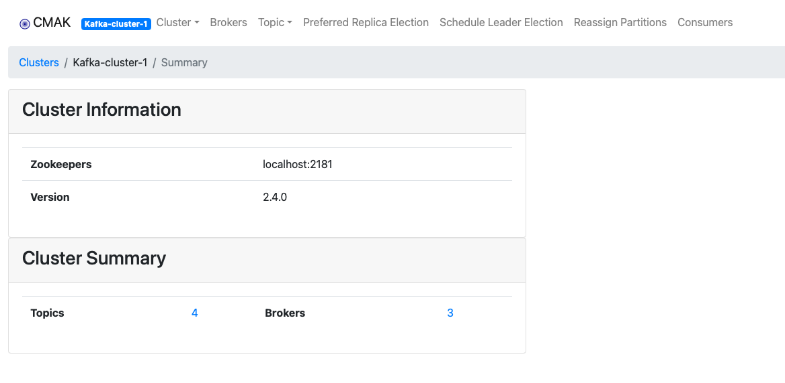

# Week 13 作业题目:

## 周三作业：

### 1.（必做）搭建一个 3 节点 Kafka 集群，测试功能和性能；实现 spring kafka 下对 kafka 集群的操作，将代码提交到 github。

> [详细步骤](./0101spring-kafka-demo/README.md)
> 
> [Application.java](./0101spring-kafka-demo/src/main/java/com/example/springkafkademo/Application.java)

### 2.（选做）安装 kafka-manager 工具，监控 kafka 集群状态。
> 下载release包 [cmak-3.0.0.5](https://github.com/yahoo/CMAK/releases/download/3.0.0.5/cmak-3.0.0.5.zip)

修改配置文件`application.conf`，配置ZK服务地址：
```shell
kafka-manager.zkhosts="localhost:2181"
cmak.zkhosts="localhost:2181"
```
启动cmak
```shell
chmod +x ./bin/cmak
./bin/cmak
```
> 注意：官方文档说明需要使用JDK11+

访问 `http://localhost:9000`并新增集群Cluster



### 3.（挑战☆）演练本课提及的各种生产者和消费者特性。

### 4.（挑战☆☆☆）Kafka 金融领域实战：在证券或者外汇、数字货币类金融核心交易系统里，对于订单的处理，大概可以分为收单、定序、撮合、清算等步骤。其中我们一般可以用 mq 来实现订单定序，然后将订单发送给撮合模块。

- 收单：请实现一个订单的 rest 接口，能够接收一个订单 Order 对象；
- 定序：将 Order 对象写入到 kafka 集群的 order.usd2cny 队列，要求数据有序并且不丢失；
- 撮合：模拟撮合程序（不需要实现撮合逻辑），从 kafka 获取 order 数据，并打印订单信息，要求可重放, 顺序消费, 消息仅处理一次。

## 周日作业：

### 1.（选做）自己安装和操作 RabbitMQ，RocketMQ，Pulsar，以及 Camel 和 Spring Integration。

### 2.（必做）思考和设计自定义 MQ 第二个版本或第三个版本，写代码实现其中至少一个功能点，把设计思路和实现代码，提交到 GitHub。

详细见[MY_MQ.md](./MY_MQ.md)

### 3.（挑战☆☆☆☆☆）完成所有其他版本的要求。期限一年。